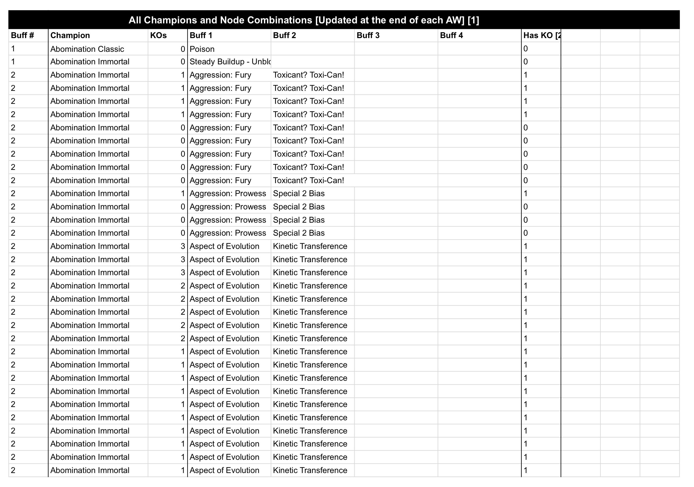

# MARC'S FINAL PROJECT

## Marvel Contest of Champions

For my project, I created a program that can recognize faces and numbers from a game called Marvel's Contest of Champions, pair them together, and print the data in SQL.

Marvel Contest of Champions is a fighting game with 200+ characters from the Marvel IP. As you play, you can recruit and level up these "champions".


In Marvel's Contest of Champions, you can join an "alliance" (or faction) of up to 30 players. There is an alliance competitive mode called "Alliance War" in which two alliances compete against each other. Each alliance is split into three "battlegroups" of 10 and each battlegroup faces off against each other (10v10, 10v10, and 10v10).

In this competitive mode, there are two phases: a Placement Phase and an Attack Phase. During the placement phase, each players places up to 5 champions on a "battlemap". Once all 10 players place their defenders, the Attack Phase commences and each player brings in champions to clear the map of the opposing team's defenders. Your alliance earns extra points if all champions are unique (without duplicating any champions).


Each battlemap has 55 Nodes (empty spots) to place your defenders. Each Node has a unique set of "buffs" (special abilities) that make your defenders harder to fight. Depending on the level of your alliance, there are up to 5 different tiers of battlemaps, each with different nodes.

With over 200 champions and 275 nodes, there are over 50,000 different combinations of champions and node. My job is to test all 50,000 combinations and computate the most mathematically optimal placements based on the available roster of all 30 players in my alliance.

## Logic and Databases: Google Sheets and SQL

Google Sheets has its own "language", but also allows users to write in SQL. The following logic is done entirely in Google Sheets and SQL. To find the best possible placements, we need really, really good logic. And lots of data. Here's how we do it:

1) Each player's roster is uploaded into a database (sorted by a "Class" that allows the optimizer to analyze sections of data at a time).

  

2) At the end of an Alliance War, I track the placements (which champions on which nodes) and how many times each champion defeated an enemy player.  

  

3) This data is uploaded to a database that tracks the champion, their buffs, their success (boolean), and the number of players defeated. The data is now ready to be processed. 

  

3) Before the next Alliance War, new champions are chosen for each player following this logic:

* Each player must be assigned 5 champions
* All 50 champions must be unique (10 players with 5 defenders each)

To do this, each "class" of champions is scanned and champions are chosen following this logic:

* Pair each champion with their player in a `roster_list`
* Sort champions by winrate
* Select the champion with the best winrate for each class
* Place the champion in its player's `player_list`
* Remove the champion from the `roster_ list` so it cannot be selected again
* Repeat this process `while` there are less than 50 champions and `while` a player has less than 5 champions in their `player_list`
* Skip any player with 5 champions in their `player_list`

 

4) Now that the best champions have been chosen from each player's roster, we must test every combination of 50 champions with 55 nodes (2,750 combinations, 9.415691937 E+8265 permutations). To speed up the process of this calculation, each "placement" (combination of champion and nodes) is tested and its winrate printed individually before testing the next placement (rather than computating them all at once). The logic is simple:

* Each champion is given a unique ID number (to distinguish from any duplicates)
* Test one permutation of 50 champions placed on 55 nodes
* Print the average winrate
* Repeat until all combinations are calculated
* Print the placements with the highest winrate

 

5) Finally, create a nice user interface that anyone can use and understand:

 

These calculations require the use of many Google Sheets (because there is a 5 million cell limit). A couple examples of these logic, formulae, and SQL can be found in this database used for the optimizers:

* [MCOC Alliance War Optimizer](https://docs.google.com/spreadsheets/d/1vYptxvZ4l3XUVwr3kviyCVoFM_EPUCMlq36GwLfED8M/edit#gid=1247101841)

A simple `QUERY` to filter and sort data:

```=QUERY(B59:E143,"Select B,C,D,E where C<>'' Order by D Desc, E Desc Limit 55")```

A `TRANSPOSE` combined with a `FILTER` to find data that has been concatenated (making data easier to read):

```
=TRANSPOSE(
        FILTER(
'[DataCAT]'!E2:'[DataCAT]'!E1002728,
('[DataCAT]'!D2:'[DataCAT]'!D1002728='[DataCAT]'!B2),
('[DataCAT]'!C2:'[DataCAT]'!C1002728='AW Placement Optimizer '!G5)
                )
        )
```

Another `FILTER` to filter data in which any column matches the inputted data for advanced searches:

```
=FILTER(
        '[DATABASE]'!D3:'[DATABASE]'!G1010000,
        (
                ('[DATABASE]'!B3:'[DATABASE]'!B1010000=A3)
                +('[DATABASE]'!I3:'[DATABASE]'!I1010000=A3)
        ),

        (
                ('[DATABASE]'!D3:'[DATABASE]'!D1010000=B3)
                +('[DATABASE]'!E3:'[DATABASE]'!E1010000=B3)
                +('[DATABASE]'!F3:'[DATABASE]'!F1010000=B3)
                +('[DATABASE]'!G3:'[DATABASE]'!G1010000=B3)
                +('[DATABASE]'!H3:'[DATABASE]'!H1010000=B3)
                +('[DATABASE]'!A3:'[DATABASE]'!A1010000=B3)
                +('[DATABASE]'!I3:'[DATABASE]'!I1010000=B3)
        ),

        (
                ('[DATABASE]'!D3:'[DATABASE]'!D1010000=C3)
                +('[DATABASE]'!E3:'[DATABASE]'!E1010000=C3)
                +('[DATABASE]'!F3:'[DATABASE]'!F1010000=C3)
                +('[DATABASE]'!G3:'[DATABASE]'!G1010000=C3)
                +('[DATABASE]'!H3:'[DATABASE]'!H1010000=C3)
                +('[DATABASE]'!A3:'[DATABASE]'!A1010000=C3)
                +('[DATABASE]'!I3:'[DATABASE]'!I1010000=C3)
        ),

        (
                ('[DATABASE]'!D3:'[DATABASE]'!D1010000=D3)
                +('[DATABASE]'!E3:'[DATABASE]'!E1010000=D3)
                +('[DATABASE]'!F3:'[DATABASE]'!F1010000=D3)
                +('[DATABASE]'!G3:'[DATABASE]'!G1010000=D3)
                +('[DATABASE]'!H3:'[DATABASE]'!H1010000=D3)
                +('[DATABASE]'!A3:'[DATABASE]'!A1010000=D3)
                +('[DATABASE]'!I3:'[DATABASE]'!I1010000=D3)
        ),

        (
                ('[DATABASE]'!D3:'[DATABASE]'!D1010000=E3)
                +('[DATABASE]'!E3:'[DATABASE]'!E1010000=E3)
                +('[DATABASE]'!F3:'[DATABASE]'!F1010000=E3)
                +('[DATABASE]'!G3:'[DATABASE]'!G1010000=E3)
                +('[DATABASE]'!H3:'[DATABASE]'!H1010000=E3)
                +('[DATABASE]'!A3:'[DATABASE]'!A1010000=E3)
                +('[DATABASE]'!I3:'[DATABASE]'!I1010000=E3)
        )
)
```

## Facial and Optical Character Recognition

All of the above is done in Google Sheets and SQL. So where does Python come in? Facial recognition!

At the end of each Alliance War, you can open a menu showing which champions were placed on which nodes, which is the first step to our process of taking data.

 

The display only shows 4 players (5 champions each) at a time. With 10 players per battlegroup, that means each round of data requires 3 screenshots.

Our goal with Python is to do the following:

1. Crop each screenshot into 20 individual images (for each character and node)
2. Transform the image into something readable by upscaling, resizing, Gaussian blurring, and more cropping
3. Compare each character with a library of known images
4. Pair each character with their node in a list
5. Print the data in SQL

```
import cv2 
import imutils
import os
import image_similarity_measures.quality_metrics
import pytesseract
import numpy as np
import sys

class Champion: 
    def __init__(self, name, node):
        self.name = name
        self.node = node

def clean_node_numbers_three(node):
    if node == "Aa":
        node = "44"
    elif node == "4&8":
        node = "38"
    elif node == "4%":
        node = "49"
    elif node == "oO":
        node = "50"
    elif node == "eB":
        node = "28"
    elif node == "on":
        node = "51"
    elif node == "a 3":
        node = "3"
    elif node == "os":
        node = "25"
    elif node == "qa":
        node = "12"
    elif node == "ag":
        node = "23"
    elif node == "og":
        node = "29"
    elif node == "oo":
        node = "22"
    return node

def clean_node_numbers_two(node):
    if node == "415":
        node = "15"
    elif node == "a5":
        node = "45"
    elif node == "of":
        node = "27"
    elif node == "S":
        node = "9"
    elif node == "413":
        node = "13"
    elif node == "AZ":
        node = "17"
    elif node == "A":
        node = "41"
    elif node == "i?":
        node = "2"
    elif node == "ao":
        node = "21"
    elif node == "A4":
        node = "44"
    elif node == "Ne":
        node = "52"
    elif node == "a1":
        node = "31"
    return node

def clean_node_numbers_one(node):
    if node == "Crs":
        node = "37"
    elif node == "cM":
        node = "20"
    elif node == "A?":
        node = "47"
    elif node == "nH?":
        node = "7"
    elif node == "1B":
        node = "8"
    elif node == "a1":
        node = "a1"
    elif node == "oa?":
        node = "27"
    elif node == "{Gg":
        node = "9"
    elif node == "49D":
        node = "13"
    elif node == "AF":
        node = "17"
    elif node == "Al":
        node = "41"
    elif node == "yo":
        node = "18"
    elif node == "EG":
        node = "6"
    elif node == "o4":
        node = "24"
    elif node == "ai":
        node = "1"
    elif node == "as":
        node = "35"
    return node

def get_number(image):
    image = imutils.resize(image, width=400)
    crop = image[140:190, 230:320]
    crop = cv2.pyrUp(crop)
    gray_image = cv2.cvtColor(crop, cv2.COLOR_BGR2GRAY)
    gray_image = cv2.GaussianBlur(gray_image, (5, 5), 0)
    placeholder, gray_image = cv2.threshold(gray_image, 0, 255, cv2.THRESH_BINARY + cv2.THRESH_OTSU,)
    gray_image = cv2.pyrUp(gray_image)
    gray_image = cv2.pyrUp(gray_image)
    inverted = np.invert(gray_image)
    return pytesseract.image_to_string(inverted, config='--psm 6')

def calc_closest_val(dict, data_dir):
        result = {}
        closest = max(dict.values())
        for key, value in dict.items():
            if (value == closest):
                result[key] = closest
                image_name = key.replace(data_dir, "")
                just_name = image_name.replace(".jpg", "")   
                return just_name
        return result

def find_champ(test_img):
    values = {}
    width = int(test_img.shape[1])
    height = int(test_img.shape[0])
    dim = (width, height)
    data_dir = './champions/'
    for file in os.listdir(data_dir):
        if sys.platform.startswith('darwin'):
            if file == '.DS_Store':
                continue
        img_path = os.path.join(data_dir, file)
        data_img = cv2.imread(img_path)
        resized_img = cv2.resize(data_img, dim, interpolation = cv2.INTER_AREA)
        values[img_path] = image_similarity_measures.quality_metrics.psnr(test_img, resized_img)
    champion_name = calc_closest_val(values, data_dir)
    return champion_name
    
if __name__ == "__main__":
    faces_path = "./champions/"
    faces = os.listdir(faces_path)
    path = './screenshots/'
    screenshots = os.listdir(path)
    filename = input("Enter SQL file name:")
    f = open(filename + ".sql", "w")
    print("sqlite3 " + filename + ".db")
    f.write("sqlite3 " + filename + ".db\n")
    print("CREATE TABLE '" + filename + "' ('champ' text, 'node' integer);")
    f.write("CREATE TABLE '" + filename + "' ('champ' text, 'node' integer);\n")
    champion_collection = list()
    r = 1
    while r < 4:
        img = cv2.imread(path + screenshots[r])
        img = imutils.resize(img, width=1400)
        a = 168
        b = 268
        c = 630
        d = 730
        i = 0
        j = 0
        while i < 4:
            while j < 5:
                crop = img[a:b, c:d]
                name = find_champ(crop)
                name = name.strip()
                node = get_number(crop)
                node = node.strip()
                node = node.replace(",", "")
                node = node.replace(".", "")
                node = node.replace(")", "")
                node = node.replace("(", "")
                node = clean_node_numbers_one(node)
                node = clean_node_numbers_two(node)
                node = clean_node_numbers_three(node)
                curr = Champion(name, node)
                c += 88
                d += 88
                j += 1
                u = 0
                if (len(champion_collection) == 0):
                    champion_collection.append(curr)
                else:
                    while u < len(champion_collection):
                        if champion_collection[u].name != curr.name and champion_collection[u].node != curr.node:
                            champion_collection.append(curr)
                            break
                        u += 1
            j = 0
            a += 98
            b += 98
            c = 630
            d = 730
            i += 1
        i = 0
        j = 0
        r += 1
    while i < len(champion_collection):
        curr = champion_collection[i]
        print("INSERT INTO " + filename + " (champ, node) VALUES('" + curr.name + "', " + curr.node + ");")
        f.write("INSERT INTO " + filename + " (champ, node) VALUES('" + curr.name + "', " + curr.node + ");\n")
        i += 1
```

First, we import a number of packages:

`import cv2 ` is an image library that allows you to manipulate images. 
`import imutils` is a more specialized library, which allows us to resize images.  
`import os` lets us navigate directories based on your operating system.  
`import image_similarity_measures.quality_metrics` gives us metrics we can use to compare the similarity between images.  
`import pytesseract` is a character recognition package we use for numbers.  
`import numpy as np` is a number library that contains more complex math functions (used in conjunction with cv2). Numpy is commonly imported as "np".  
`import sys` gives you access to system-specific functions.

```
class Champion: 
    def __init__(self, name, node):
        self.name = name
        self.node = node
```

We define a new class called `Champion`, which can be identified by `self`, `name`, and `node`. Self is the object we create, name is the name of the champion we identify, and node is the number we identity. `self.name` and `self.node` are properties of the object and we define them as the name and node that we identify.

```
def clean_node_numbers_three(node):
    if node == "Aa":
        node = "44"
    elif node == "4&8":
        node = "38"
    elif node == "4%":
        node = "49"
    elif node == "oO":
        node = "50"
    elif node == "eB":
        node = "28"
    elif node == "on":
        node = "51"
    elif node == "a 3":
        node = "3"
    elif node == "os":
        node = "25"
    elif node == "qa":
        node = "12"
    elif node == "ag":
        node = "23"
    elif node == "og":
        node = "29"
    elif node == "oo":
        node = "22"
    return node

def clean_node_numbers_two(node):
    if node == "415":
        node = "15"
    elif node == "a5":
        node = "45"
    elif node == "of":
        node = "27"
    elif node == "S":
        node = "9"
    elif node == "413":
        node = "13"
    elif node == "AZ":
        node = "17"
    elif node == "A":
        node = "41"
    elif node == "i?":
        node = "2"
    elif node == "ao":
        node = "21"
    elif node == "A4":
        node = "44"
    elif node == "Ne":
        node = "52"
    elif node == "a1":
        node = "31"
    return node

def clean_node_numbers_one(node):
    if node == "Crs":
        node = "37"
    elif node == "cM":
        node = "20"
    elif node == "A?":
        node = "47"
    elif node == "nH?":
        node = "7"
    elif node == "1B":
        node = "8"
    elif node == "a1":
        node = "a1"
    elif node == "oa?":
        node = "27"
    elif node == "{Gg":
        node = "9"
    elif node == "49D":
        node = "13"
    elif node == "AF":
        node = "17"
    elif node == "Al":
        node = "41"
    elif node == "yo":
        node = "18"
    elif node == "EG":
        node = "6"
    elif node == "o4":
        node = "24"
    elif node == "ai":
        node = "1"
    elif node == "as":
        node = "35"
    return node
```

Because the library `pytesseract` is not trained to recognize the number font used in the game, it will mistake certain numbers as other numbers/alphabet characters. Without creating our own number recognition program, the next best solution is to replace these misinterpretations as the number they are intended to be. For example, `pytesseract` recognizes the number `18` as `yo`, so in our definition, if we detect `node` == `yo`, then we instead output `18`. Due to a limit on how many elifs can be present in a function, these have to be separated into three separate functions.

Next, we define a new function, `def get_number(image):`, that we can use later to identify the number in our image. Because each screenshot contains up to 20 champions/node, each screenshot is cropped 20 times around each champion/node.

```
def get_number(image):
    image = imutils.resize(image, width=400)
    crop = image[140:190, 230:320]
    crop = cv2.pyrUp(crop)
    gray_image = cv2.cvtColor(crop, cv2.COLOR_BGR2GRAY)
    gray_image = cv2.GaussianBlur(gray_image, (5, 5), 0)
    placeholder, gray_image = cv2.threshold(gray_image, 0, 255, cv2.THRESH_BINARY + cv2.THRESH_OTSU,)
    gray_image = cv2.pyrUp(gray_image)
    gray_image = cv2.pyrUp(gray_image)
    inverted = np.invert(gray_image)
    return pytesseract.image_to_string(inverted, config='--psm 6')
```

`image = imutils.resize(image, width=400)` resizes the cropped image into something larger and more readable.  
`crop = image[140:190, 230:320]` crops the number out of the cropped image.  
`crop = cv2.pyrUp(crop)` upscales the image clarity, increasing readability more.  
`gray_image = cv2.cvtColor(crop, cv2.COLOR_BGR2GRAY)` converts the image to black and white, also increasing readability.  
`gray_image = cv2.GaussianBlur(gray_image, (5, 5), 0)` blurs the image surrounding the number, increasing the readability of the number.  
`gray_image = cv2.threshold(gray_image, 0, 255, cv2.THRESH_BINARY + cv2.THRESH_OTSU,)` convers the image to strictly black and white without any grayscale. `cv2.THRESH_BINARY` dictates that values must be returned either `0` (black) or `255` (white), and `cv2.THRESH_OTSU` averages the color of a region of pixels.  
`gray_image = cv2.pyrUp(gray_image)` upscales the cropped number again.  
`inverted = np.invert(gray_image)` inverts the colors of the cropped image because the numbers are white but black numbers are better identified.  
`return pytesseract.image_to_string(inverted, config='--psm 6')` passes the cropped, upscaled, and modified number through `pytesseract` to identify the number. `config` is a configuration of `pytesseract` that specifically identifies a single block of text.

Next, we define a function that compares the values of the cropped image with all known champions in our directory. `dict` is a list of number values for each known image and how similar they are to the cropped image, and `data_dir` is path to the directory of the known images.

```
def calc_closest_val(dict, data_dir):
        result = {}
        closest = max(dict.values())
        for key, value in dict.items():
            if (value == closest):
                result[key] = closest
                image_name = key.replace(data_dir, "")
                just_name = image_name.replace(".jpg", "")   
                return just_name
        return result
```

`result = {}` defines an empty list, which we will populate.  
`closest = max(dict.values())` defines `closest` as the highest `dict` value.  

Each known image contains a `key`, which is the image, and a `value`, which is the similarity to the cropped image. For each `key` and `value` pairing (that is, for each known image):

`if` the `value` of our image is the `closest` value, then we pair the `key` and the `closest` value in our `result`.

Then we pull the directory of the known image (ex. "./champions/Domino.jpg") and remove the directory (`./champions/`) and the `.jpg` from the string, leaving us with `Domino`. Finally, we print the name and the result.

The next block of code identifies the values that are references above:

```
def find_champ(test_img):
    values = {}
    width = int(test_img.shape[1])
    height = int(test_img.shape[0])
    dim = (width, height)
    data_dir = './champions/'
    for file in os.listdir(data_dir):
        if sys.platform.startswith('darwin'):
            if file == '.DS_Store':
                continue
        img_path = os.path.join(data_dir, file)
        data_img = cv2.imread(img_path)
        resized_img = cv2.resize(data_img, dim, interpolation = cv2.INTER_AREA)
        values[img_path] = image_similarity_measures.quality_metrics.psnr(test_img, resized_img)
    closest = calc_closest_val(values, data_dir)
    return closest
```

First, we define our image's `width`, `height`, dimension (`dim`), and data directory (`data_dir`). For each `file` in our `data_dir`, we identify the image path (`img_path`) and the image itself (`data_img`). (The image path is a concatenation of the data directory (`data_dir`) and the `file` name.)

On MacOS, every folder contains a `.DS_Store` file, which crashes the program. To work around this:

1) `if sys.platform.startswith('darwin'):` identifies the operating system as a Mac.  
2) `if file == '.DS_Store':` tells us if there is a `.DS_Store` file.  
3) `continue` skips this operation on the `.DS_Store` file

For every known image in our directory (renamed to `resized_img` and resized to a square, which can be read by the library), we compare it to our `test_img`:

`image_similarity_measures.quality_metrics.psnr(test_img, resized_img)`

Then we pair this `value` with the image (`img_path`), which is then referenced in our previous function `calc_closest_value`.

Now that we've defined functions that can identity the champion name and node of every image, we can run them across every screenshot, each of which containing up to 20 champion and node combinations:

```
if __name__ == "__main__":
    faces_path = "./champions/"
    faces = os.listdir(faces_path)
    path = './screenshots/'
    screenshots = os.listdir(path)
    filename = input("Enter SQL file name:")
    f = open(filename + ".sql", "w")
    print("sqlite3 " + filename + ".db")
    f.write("sqlite3 " + filename + ".db\n")
    print("CREATE TABLE '" + filename + "' ('champ' text, 'node' integer);")
    f.write("CREATE TABLE '" + filename + "' ('champ' text, 'node' integer);\n")
    champion_collection = list()
    r = 1
    while r < 4:
        img = cv2.imread(path + screenshots[r])
        img = imutils.resize(img, width=1400)
        a = 168
        b = 268
        c = 630
        d = 730
        i = 0
        j = 0
        while i < 4:
            while j < 5:
                crop = img[a:b, c:d]
                name = find_champ(crop)
                name = name.strip()
                node = get_number(crop)
                node = node.strip()
                node = node.replace(",", "")
                node = node.replace(".", "")
                node = node.replace(")", "")
                node = node.replace("(", "")
                node = clean_node_numbers_one(node)
                node = clean_node_numbers_two(node)
                node = clean_node_numbers_three(node)
                curr = Champion(name, node)
                c += 88
                d += 88
                j += 1
                u = 0
                if (len(champion_collection) == 0):
                    champion_collection.append(curr)
                else:
                    while u < len(champion_collection):
                        if champion_collection[u].name != curr.name and champion_collection[u].node != curr.node:
                            champion_collection.append(curr)
                            break
                        u += 1
            j = 0
            a += 98
            b += 98
            c = 630
            d = 730
            i += 1
        i = 0
        j = 0
        r += 1
    while i < len(champion_collection):
        curr = champion_collection[i]
        print("INSERT INTO " + filename + " (champ, node) VALUES('" + curr.name + "', " + curr.node + ");")
        f.write("INSERT INTO " + filename + " (champ, node) VALUES('" + curr.name + "', " + curr.node + ");\n")
        i += 1
```

`if __name__ == "__main__":` tests whether our module is being run directly or being imported (and essentially acts as a "guard" to stop our code from referencing things incorrectly).  
`faces_path = "./champions/"` defines the path to our known images.  
`faces = os.listdir(faces_path)` is the set of all images in the directory.  
`path = './screenshots/'` defines the path to our uploaded screenshots.  
`screenshots = os.listdir(path)` is the set of all screenshots in the directory.
`filename = input("Enter SQL file name:")` prompts you to name the SQL database and file name in which data will be entered.  
`f = open(filename + ".sql", "w")` creates an SQL file with the inputted `filename` and marks it as writable. `f` is the variable which will be referenced later.

`print("sqlite3 " + filename + ".db")` generates a line of code in the terminal that can be used to create an SQL database. (ex. sqlite3 testfile.db)  
`f.write("sqlite3 " + filename + ".db\n")` writes the line of code in the SQL file.  
`print("CREATE TABLE '" + filename + "' ('champ' text, 'node' integer);")` generates a line of code in the terminal can be used to enter data into an SQL database. (ex. CREATE TABLE 'testfile' ('champ' text, 'node' integer);)  
`f.write("CREATE TABLE '" + filename + "' ('champ' text, 'node' integer);\n")` writes the line of code in the SQL file.

`champion_collection = list()` is a list where champions will be paired with nodes.

Every screenshot contains 4 rows of up to 5 champions, so the screenshot must be cropped 20 times to produce individual images of each champion and node:

```
 r = 1
    while r < 4:
        img = cv2.imread(path + screenshots[r])
        img = imutils.resize(img, width=1400)
        a = 168
        b = 268
        c = 630
        d = 730
        i = 0
        j = 0
        while i < 4:
            while j < 5:
            		...
					c += 88
					d += 88
					j += 1
					u = 0
```

First, we crop all 20 champions and nodes from our screenshots using the while loops above:

```
crop = img[a:b, c:d]
```

Then we use the `find_champ` function to identify the champion and remove any extra spaces from the champion name:

```
name = find_champ(crop)
name = name.strip()
```

Then we use the `get_number` function to identify the node number and remove any extra spaces from the number name:

```
name = get_number(crop)
name = name.strip()
```

Then we pass the node number through our text replacement elifs to replace any font misinterpretations:

```
node = clean_node_numbers_one(node)
node = clean_node_numbers_two(node)
node = clean_node_numbers_three(node)
```

Then we define `curr` as the pair of `name` and `node`:

```
curr = Champion(name, node)
```

Because each screenshot contains 4 rows (1 for each player) but in every "Alliance War", there are 10 players, one of the screenshots will contain champions belonging to a duplicate player (4+4+4). So for every champion and node pairing we've identified and added to our list, we check for duplicates:

```
u = 0
if (len(champion_collection) == 0):
	champion_collection.append(curr)
else:
	while u < len(champion_collection):
		if champion_collection[u].name != curr.name and champion_collection[u].node != curr.node:
			champion_collection.append(curr)
			break
u += 1
```

For every champion and node pairing we've identified, we generate a line of code that can be used to input data into our SQL database:

```
while i < len(champion_collection):
	curr = champion_collection[i]
	print("INSERT INTO " + filename + " (champ, node) VALUES('" + curr.name + "', " + curr.node + ");")
	f.write("INSERT INTO " + filename + " (champ, node) VALUES('" + curr.name + "', " + curr.node + ");\n")
	i += 1
```

(ex. INSERT INTO test_file (champ, node) VALUES('Agent Venom', 34);)

Our final results should look like this:

```
sqlite3 test_file.db
CREATE TABLE 'test_file' ('champ' text, 'node' integer);
INSERT INTO test_file (champ, node) VALUES('Agent Venom', 34);
INSERT INTO test_file (champ, node) VALUES('Wasp', 38);
INSERT INTO test_file (champ, node) VALUES('Medusa', 49);
INSERT INTO test_file (champ, node) VALUES('Thing', 50);
INSERT INTO test_file (champ, node) VALUES('Vision Aarkus', 28);
INSERT INTO test_file (champ, node) VALUES('Agent Venom', 51);
INSERT INTO test_file (champ, node) VALUES('Mephisto', 15);
INSERT INTO test_file (champ, node) VALUES('Black Widow CV', 36);
INSERT INTO test_file (champ, node) VALUES('Man-Thing', 40);
INSERT INTO test_file (champ, node) VALUES('Magneto Classic', 43);
INSERT INTO test_file (champ, node) VALUES('Ebony Maw', 3);
...
```

...AND WE'RE DONE!

## Summary
The steps to optimizing data is complex and many, but never impossible. The code above covers just the first step to my data optimization: tracking faces and printing data.

Not only is this code the tip of the iceberg of the calculations that need to be made, but there's also so much more you can do with data, Python, and SQL.

Thanks for tuning in!

 